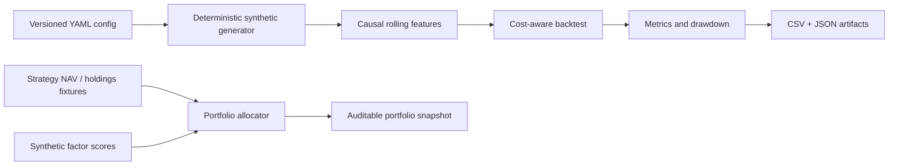

# Architecture

## Design principles

1. **No look-ahead:** rolling features are based on observations available before the current signal.
2. **Explicit costs:** position changes incur configurable transaction costs.
3. **Deterministic inputs:** fixed seeds make examples and tests reproducible.
4. **Small, inspectable outputs:** CSV and JSON artifacts are easy to reconcile.
5. **Disclosure by construction:** the public demo never needs private datasets.
